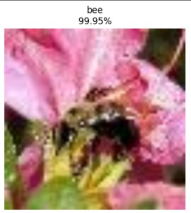
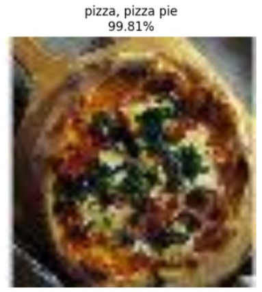
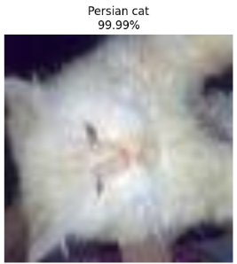
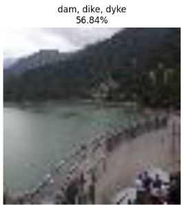
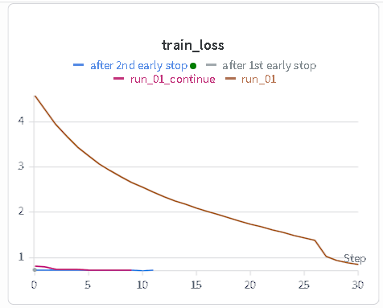
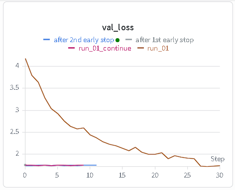
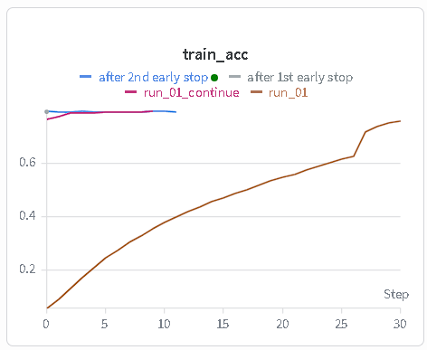
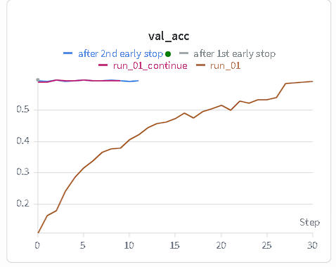
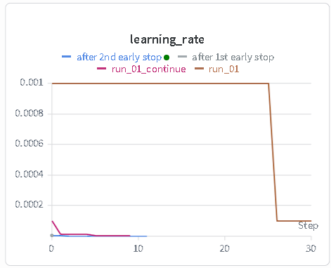

# VGG19: Very Deep Convolutional Networks for Large-Scale Image Recognition

## Empirical Inference Showcase
Below are live validation inference samples generated by this scratch implementation on the Tiny ImageNet validation split, showing the raw inputs alongside the network's top predicted object classifications and soft-max confidence metrics:

| Sample A | Sample B |
| :---: | :---: |
|  <br> **Predicted:** bee (99.95%) |  <br> **Predicted:** pizza, pizza pie (99.81%) |

| Sample C | Sample D |
| :---: | :---: |
|  <br> **Predicted:** Persian cat (99.99%) |  <br> **Predicted:** dam, dike, dyke (56.84%) |

The VGG19 architecture utilizes a deep, homogeneous stack of small $3 \times 3$ receptive fields to construct localized spatial representations. Given a multi-class discriminative classification task, the model is optimized using Cross-Entropy Loss with integrated $L_2$ regularization over the discrete parameter domain.

## Core Motivation & Research Roadmap

The primary objective of this project is not focused around maximizing accuracy raw scores or scaling up production-level pre-trained representations. Rather, this codebase serves as a deep dive into the inner mechanical layers and latent features that anchor modern computer vision paradigms.

The long-term trajectory of this engineering sandbox is to implement the classic paper **"A Neural Algorithm of Artistic Style"** completely from scratch. While standard workflows utilize vanilla pre-trained network downloads out of the box, building the feature extraction engine brick-by-brick exposes the underlying structural dynamics that dictate optimal style and content optimization.

To support modular research experimentation, the subsequent Neural Style Transfer engine will be decoupled from the framework, allowing the latent feature extractor to be dynamically swapped across:

* **Official Pre-trained VGG19 Parameters** (For absolute baseline fidelity metrics)
* **Custom VGG19 Scratch Implementation** (To test convergence boundaries and initialization variants)
* **Future Experimental Architectures** (For evaluating alternative convolutional backbones)

---

## Optimization Objective

The objective function combines multi-class Cross-Entropy Loss with an $L_2$ regularization penalty (weight decay) formulated over the network's trainable parameters:

$$\mathcal{L}(\theta) = -\frac{1}{N} \sum_{i=1}^{N} \sum_{k=1}^{K} y_{i,k} \log\left(\hat{y}_{i,k}(\theta)\right) + \frac{\lambda}{2} \|\theta\|_2^2$$

Where $N$ represents the batch size, $K$ is the number of target classes ($200$ for Tiny ImageNet), $y_{i,k}$ is the ground-truth target label index indicator, $\lambda$ matches the active weight decay coefficient ($5 \times 10^{-4}$), and $\hat{y}_{i,k}$ represents the estimated class probability distribution evaluated from the final soft-max function:

$$\hat{y}_{k}(x) = \frac{\exp(a_k(x))}{\sum_{k'=1}^{K} \exp(a_{k'}(x))}$$

---

## Evaluation Metrics

To evaluate generalization behavior and multi-class precision across dense classification spaces, the following research-grade metrics are tracked over the training and validation runs:

### 1. Classification Target Accuracy

Measures the proportion of isolated input samples where the maximum predicted probability corresponds directly to the ground-truth class label:

$$\text{Accuracy} = \frac{1}{N} \sum_{i=1}^{N} \mathbb{I}\left( \arg\max_{k} \hat{y}_{i,k} = \arg\max_{k} y_{i,k} \right)$$

### 2. Multi-Class Loss Path Curves

Monitors convergence stability and cross-entropy distribution penalties across localized training steps, tracking validation margins to catch signs of early overfitting.

Where $\mathbb{I}(\cdot)$ is the standard indicator function resolving to $1$ if the top prediction perfectly satisfies the target label constraint and $0$ otherwise.

---

# VGG19-Paper-PyTorch-Implementation

This repository implements the original, classical VGG19 architecture proposed in the foundational paper:

**Very Deep Convolutional Networks for Large-Scale Image Recognition** Paper: [https://arxiv.org/abs/1409.1556](https://arxiv.org/abs/1409.1556)

The project focuses on replicating the architectural configurations established by Simonyan & Zisserman entirely from scratch in PyTorch. While following the sequence of 16 convolutional layers and 3 fully connected layers, this repository incorporates strategic engineering adjustments. While the original paper utilized a normal distribution initialization ($\mu=0, \sigma=0.01$) alongside structural layer pre-training, modern gradient flows are stabilized here using **Kaiming Normal Initialization** combined with integrated **Batch Normalization** layers to robustly counter vanishing and exploding gradient bottlenecks.

## Technical Blog

I have documented the complete step-by-step implementation journey, mathematical breakdown of small receptive fields, spatial dimensionality reduction, and structural initialization experiments here:

<!-- [My Journey of Implementing VGG19 From Scratch](https://www.google.com/search?q=YOUR_MEDIUM_BLOG_LINK_PLACEHOLDER) -->
[My Journey of Implementing VGG19 From Scratch] [I'll add the link when the blog is published]

The repository contains:

* Pure PyTorch implementation of the deep 19-layer VGG configuration (VGG19).
* Modular object architecture separating convolutional stacks, max-pooling drives, and dense linear classifiers.
* Custom tensor integrity scripts verifying structural flatness over the $512 \times 7 \times 7$ feature boundary.
* Integrated switch configurations comparing classical normal weight initialization against Kaiming heuristics.
* Multi-stage diagnostic scripts designed to overfit tiny data batches to guarantee network backpropagation viability.

---

# Repository Objective

The primary objective of this implementation is to analyze:

* **Deep Receptive Field Dynamics**: Examining how stacking multiple $3 \times 3$ convolutions mimics larger receptive fields (e.g., $7 \times 7$) while decreasing parametric complexity and adding non-linear activation boundaries.
* **Initialization Optimization Barriers**: Documenting the convergence failures of original paper normal initializations ($\mu=0, \sigma=0.01$) on modern un-pretrained configurations and proving the necessity of Kaiming initialization mappings.
* **Batch Normalization Convergence Acceleration**: Comparing optimization loss journeys and tracking backpropagation scaling behavior with and without structural batch normalization layers.

### Advanced Multi-Experiment Lab

This codebase represents the baseline structural implementation configuration. Advanced architectural modifications and extensions are tracked separately under individual experiment branches within the central research laboratory:

* **Advanced Variations**: [Generative Architectures Lab - VGGs](https://github.com/Himanshu7921/generative-architectures-lab/blob/main/07_VGG19/vgg19.ipynb)

Experimental branches include configurations detailing sanity check overfitting profiles under various training combinations:

```text
# Experiment-A: Using BatchNorm + SGD (lr = 0.001, momentum = 0.9)
# Overfitting on Batch Size = 10 | Convergence Target Achieved at Epoch 8 / 100
Epoch [0/100] | Loss = 6.528 | Accuracy = 0.0%
Epoch [8/100] | Loss = 0.073 | Accuracy = 100.0% -> Exiting Success

# Experiment-B: Not using BatchNorm + SGD (lr = 0.001, momentum = 0.9)
# Overfitting on Batch Size = 10 | Convergence Target Achieved at Epoch 90 / 100
Epoch [0/100] | Loss = 5.321 | Accuracy = 0.0%
Epoch [90/100] | Loss = 0.029 | Accuracy = 100.0% -> Exiting Success

# Experiment-C: Not Using BatchNorm + SGD (lr = 0.0001, momentum = 0.9)
# Overfitting on Batch Size = 10 | Convergence Target Achieved at Epoch 40 / 100
Epoch [0/100] | Loss = 5.315 | Accuracy = 0.0%
Epoch [40/100] | Loss = 0.722 | Accuracy = 100.0% -> Exiting Success

```

---

# Dataset

Training was conducted on the **Tiny ImageNet Dataset**. Input samples are scaled to the standardized paper configuration space of $224 \times 224$ pixels. The structural convolutions yield a feature representation map of $512 \times 7 \times 7$, which flattens out to $25,088$ unique spatial input features prior to fully connected projection.

Dataset characteristics:

| Property | Value |
| --- | --- |
| Dataset Target | Tiny ImageNet Dataset |
| Target Type | 200-Class Fine-Grained Object Targets |
| Input Channels | 3 (RGB Color Configurations) |
| Input Resolution ($H \times W$) | $224 \times 224$ pixels |
| Flattened Layer Input Dimension | $25088$ Features ($512 \times 7 \times 7$) |
| Total Classification Classes ($K$) | 200 Target Categories |

---

# Training Results & Convergence Curves

The optimization progress over the training cycles maps out structural convergence behaviors against localized early stopping configurations. Progress is evaluated across loss tracking scales and validation checks, verifying correct gradients.

Here are some of the key results and convergence curves from My VGG19 model training:

| Training Loss Journey | Validation Loss Journey |
| :---: | :---: |
|  |  |

My loss curve shows a steady optimization downward path, reflecting stable cross-entropy convergence. At the same time, the classification accuracy metric tracks an upward trajectory across validation loops, demonstrating correct multi-class feature extraction.

| Training Accuracy Progression | Validation Accuracy Progression |
| :---: | :---: |
|  |  |

| Learning Rate Schedule Flow |
| :---: |
|  |

---

# Architectural Design Principles

The structural layout metrics map out the design changes implemented in this repository compared to the parameters of the original paper:

| Design Choice | Paper Protocol Specs | Structural Implementation Mechanics |
| --- | --- | --- |
| **Small Receptive Fields** | Stated $3 \times 3$ Convolutions | Stacked processing stages with standard `padding=1` and `stride=1`. |
| **Weight Initialization** | Gaussian ($\mu=0, \sigma=0.01$) | Replaced with **Kaiming Normal** to fix convergence issues during scratch training. |
| **Batch Normalization** | Not Addressed (2014 Era) | Integrated `BatchNorm2d()` across conv blocks to stabilize deeper gradient scales. |
| **Pooling Partitions** | Max-Pooling ($2 \times 2$, $s=2$) | Formulated explicitly across 5 downsampling junction modules. |
| **Classifier Layout** | 3 Dense Linear Layers | Maps $25088 \rightarrow 4096 \rightarrow 4096 \rightarrow 200$ target classes. |

---

# Training Configuration

The hyperparameters listed below are loaded from the project's config engine during optimization:

| Hyperparameter Metric | Operational Assigned Value |
| --- | --- |
| **Initial Learning Rate ($\eta$)** | $1 \times 10^{-3}$ |
| **Optimization Routine** | SGD Optimizer |
| **Momentum Parameter Factor** | $0.9$ |
| **Weight Decay ($L_2$ Regularization)** | $5 \times 10^{-4}$ |
| **Batch Sizing Constraint** | 24 Samples |
| **Target Epoch Lifecycle** | 200 Max Epochs (Early Stopping Enabled) |
| **Hardware Compute Device** | `cuda` (GPU Accelerated Execution) |
| **Hidden Filter Output Depth** | Block-1 ($64$), Block-2 ($128$), Block-3 ($256$), Block-4 ($512$), Block-5 ($512$) |

---

# Project Structure

```text
├── assets/                       # Stored evaluation curves, metrics, and classification plots
├── checkpoints/                  # Localized training model checkpoints (.pth)
├── data/                         # Raw dataset directory (Tiny ImageNet images & class mappings)
├── wandb/                        # Weights & Biases operational experiment tracking logs
│
├── src/
│   ├── block.py                  # Standard VGG layer groupings (Conv2D + BatchNorm + ReLU)
│   ├── config.py                 # Centralized hyperparameter and training configuration
│   ├── convnets.py               # Assembly logic for sequential convolutional feature extraction
│   ├── fullyconnected.py         # Deep classifier projection block matching paper specifications
│   ├── maxpool.py                # Max-pooling abstraction layers managing spatial downsampling
│   ├── model.py                  # Core structural assembly combining convolutions and dense layers
│   ├── overfit.py                # Diagnostic script to overfit small data batches for sanity checks
│   ├── predict.py                # Inference script to run image classification evaluations
│   ├── tensor_shape_test.py      # Automated testing suite ensuring tensor integrity across blocks
│   ├── train.py                  # Main optimization loop and training pipeline execution
│   └── utils.py                  # Helper utilities (metric tracking, logging, saving plots)
│
├── .gitignore                    # Standard tracking exclusions (data, weights, caches)
└── README.md                     # Comprehensive project documentation

```

---

# Running Training

Clone the repository:

```bash
git clone https://github.com/Himanshu7921/VGG19-PyTorch-Implementation.git
cd VGG19-PyTorch-Implementation

```

Install dependencies:

```bash
pip install -r requirements.txt

```

Execute the training script:

```bash
python src/train.py

```

To run the localized diagnostic overfitting checks, execute:

```bash
python src/overfit.py

```

---

# References

1. Simonyan, K., & Zisserman, A. (2014). *Very Deep Convolutional Networks for Large-Scale Image Recognition*. International Conference on Learning Representations (ICLR) 2015. [https://arxiv.org/abs/1409.1556](https://arxiv.org/abs/1409.1556)

---

# Author

Himanshu Singh | Deep Learning Research Engineer 2026